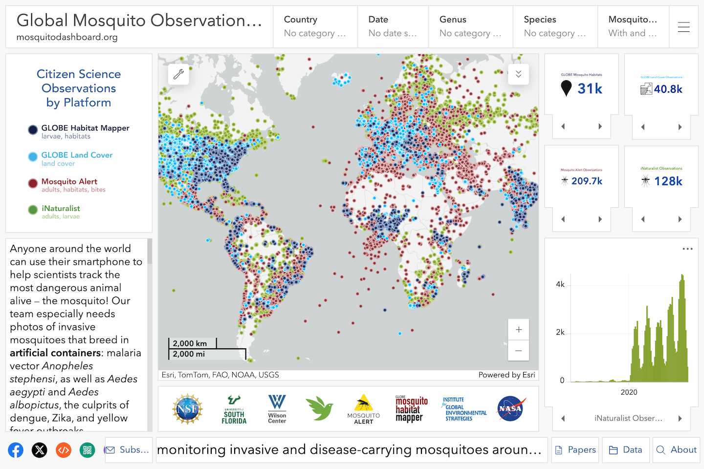

<p align="center">
  <div align="center">
    
  </div>
</p>

# Mosquito Dashboard Data Pipeline

Mosquito Dashboard Datapipeline is a mechanism for ingesting data from a variety of data sources, reformatting it, and routing it to the [Global Mosquito Observations Dashboard](https://mosquitodashboard.org) for storage and display.


Welcome Screen

## Requirements

### 1. Python3

The transformation scripts rely upon the Python3 platform.

## Instructions

To run the data transformation scripts, simply go to the src directory and then the subdirectory for the data source that you would like to transform and run the file 'parser.py' followed by the name of the input file that you would like to transform.

```
python3 src/habitat-mapper/parser.py \
  data/habitat-mapper/input/input.csv \
  data/habitat-mapper/output/output.csv

python3 src/inaturalist/parser.py \
  data/inaturalist/input/input.json \
  data/inaturalist/output/output.csv

python3 src/land-cover/parser.py \
  data/land-cover/input/input.csv \
  data/land-cover/output/output.csv

python3 src/mosquito-alert/parser.py \
  data/mosquito-alert/input/input.json \
  data/mosquito-alert/output/output.csv
```

<!-- CONTACT -->
## Contact

Abe Megahed - (mailto:amegahed@wisc.edu) - email
